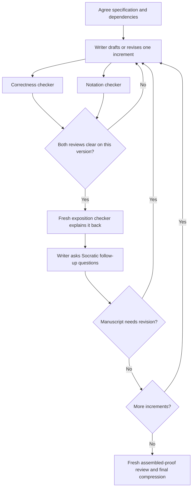

# Mathematical writing harness

Write and review a proof in reusable increments, with four roles: **paper writer**, **correctness checker**, **exposition checker**, and **notation checker**. The main conversation is the writer. JMLR is the first target.

**Terence Tao is the writing reference.** The concrete guidance on proof structure, motivation, lemma boundaries, detail, prose and compression is pre-extracted in [proof-writing](guidelines/proof-writing.md), with [notation and terminology](guidelines/notation.md) alongside it. Venue-derived criteria are pre-extracted in [reviewing principles](guidelines/reviewing-principles.md). Read these local guides for routine work; YAML front matter records the source authors, titles and URLs for attribution. No website navigation is needed to obtain the guidelines.

## Use

Normally, use two skills:

1. **Agree the work:** “Use $agree-writing-spec to agree the JMLR proof's claims, assumptions, audience and proof steps.” The writer reads the existing draft and saves the agreed decisions in `publications/jmlr/SPEC.md`. Reuse an existing agreement rather than approving it again.
2. **Write or resume:** “Use $write-and-review-paper to continue the JMLR proof from the saved specification and review status.” The writer reads `SPEC.md` and `STATUS.md`, selects the next ready increment, drafts it, and coordinates correctness, notation and exposition review. It updates the paper's status and review records as work progresses. Add a constraint such as “only the next lemma” when you want to limit the task.

[test-exposition](skills/test-exposition/SKILL.md) is usually called by [write-and-review-paper](skills/write-and-review-paper/SKILL.md) after correctness and notation clearance. It is a procedure for coordinating a fresh reader and the writer's questions, not another agent role. Invoke it directly only when you want a focused comprehension test of an already checked proof.

No special prompt is needed beyond the paper and intended scope. Naming a skill makes your choice explicit; an ordinary request matching its description can also select it. The [planning skill](skills/agree-writing-spec/SKILL.md) resolves missing material decisions rather than guessing them. Saved decisions and review records make it possible to resume in a fresh session.

The skills are discoverable under `.agents/skills` ([official documentation](https://developers.openai.com/codex/skills/)). Files in `agents/` are role instructions that the workflow explicitly loads into subagents. They do not register native agent types or enforce access restrictions by themselves. No custom runner or snapshot script is required.

## Flow

Independent branches may be reviewed in parallel. Keep one correctness checker on a dependent chain where practical; persist its evidence so replacing it does not lose state. Any final edits return through the affected reviews.

## Files and authority

The harness has three folders:

| Folder | Purpose |
| --- | --- |
| `agents/` | Who does what: the writer and the three independent checkers. |
| `skills/` | How the work proceeds. Each skill keeps its record format beside `SKILL.md`. |
| `guidelines/` | Shared writing, notation, reader-background and reviewing principles, with source attribution. |

The record formats specify what evidence to retain: the agreed claims, the version reviewed, findings and their resolutions, and unassisted versus assisted reader answers. They live with the procedures that use them; actual records live beside the paper.

Paper-specific decisions, the result inventory and reading notes belong beside the paper in `SPEC.md` and `STATUS.md`. Reuse these files when present; create them as needed during an actual writing task, with their real agreement and review state. Discover source files from the [manuscript entry point](../publications/jmlr/jmlr.tex), and use the build command in the [repository README](../README.md). Keep author interpretations out of fresh checker assignments as described below.

Manuscript definitions are the semantic authority; the existing macro file controls rendering. Conventions govern new choices. Do not create a competing copy of the macro registry. A disputed or ambiguous existing definition is a finding, not permission to silently reinterpret it.

The status file and any generated `SPEC.md` and `reviews/` records live beside the paper and remain versionable. Raw scratch transcripts can be temporary, but findings, dispositions and evidence cannot exist only in an agent's memory. No proof has been reviewed merely because the harness exists.

## Independence and model use

Start each new checker without inherited conversation history. With the available collaboration tools, use `spawn_agent` with `fork_turns: "none"` and a self-contained assignment. Never fork the writer's history into a checker. Provide only its role instructions, relevant conventions, the neutral review assignment and the specified active manuscript material. Use explicit messages for subsequent exchange.

Checkers do not browse the writer's status/specification notes, scratch files, prior conversations or another checker's unreleased reports. They may receive necessary dependency statements, proofs and citations through the assignment. The writer can forward a concrete objection after independent initial reviews are recorded. Exposition answer expectations and previous reader transcripts remain excluded from every fresh comprehension test.

This is context separation by protocol within a shared workspace, not a security sandbox. Record contamination and restart the affected independent review if excluded material is read. If fresh agents are unavailable, continue useful drafting or local checks, but record that independent review is unavailable; do not label self-review independent.

Use a strong available model for mathematical writing and correctness. Use a capable model for semantic notation review; mechanical scans can be cheaper. Use an available weaker model for the exposition probe when supported, record its actual identity, and do not equate it with a human age or ability. If that choice is unavailable, disclose the substitute. A second model family is an optional additional check for a critical or disputed argument when available, not a guarantee. Do not invent model IDs or modify global settings.
